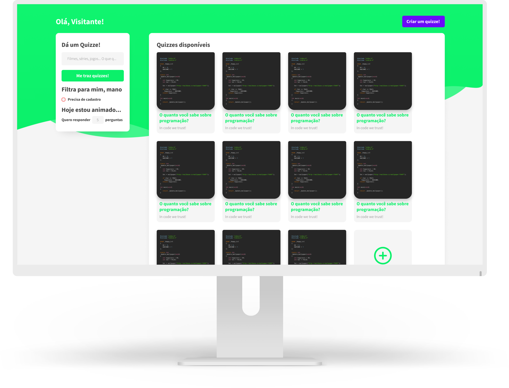

  

## Technologies
- [Node.js](https://nodejs.org/en/)
- [React](https://reactjs.org)

## About
Quizze is a project that allows users to create quizzes and share them with friends, or just for fun and for unknown people to answer.

## What you can do here?
- Private/public quizzes
- Quizzes that need registration
- Quizzes with up to 20 questions
- Questions with images
- Filter quizzes by number of questions, title/description and registration required

## Back-end
Would you like to clone this repository? Also check our [Backend](https://github.com/quizze-project/back-end)!